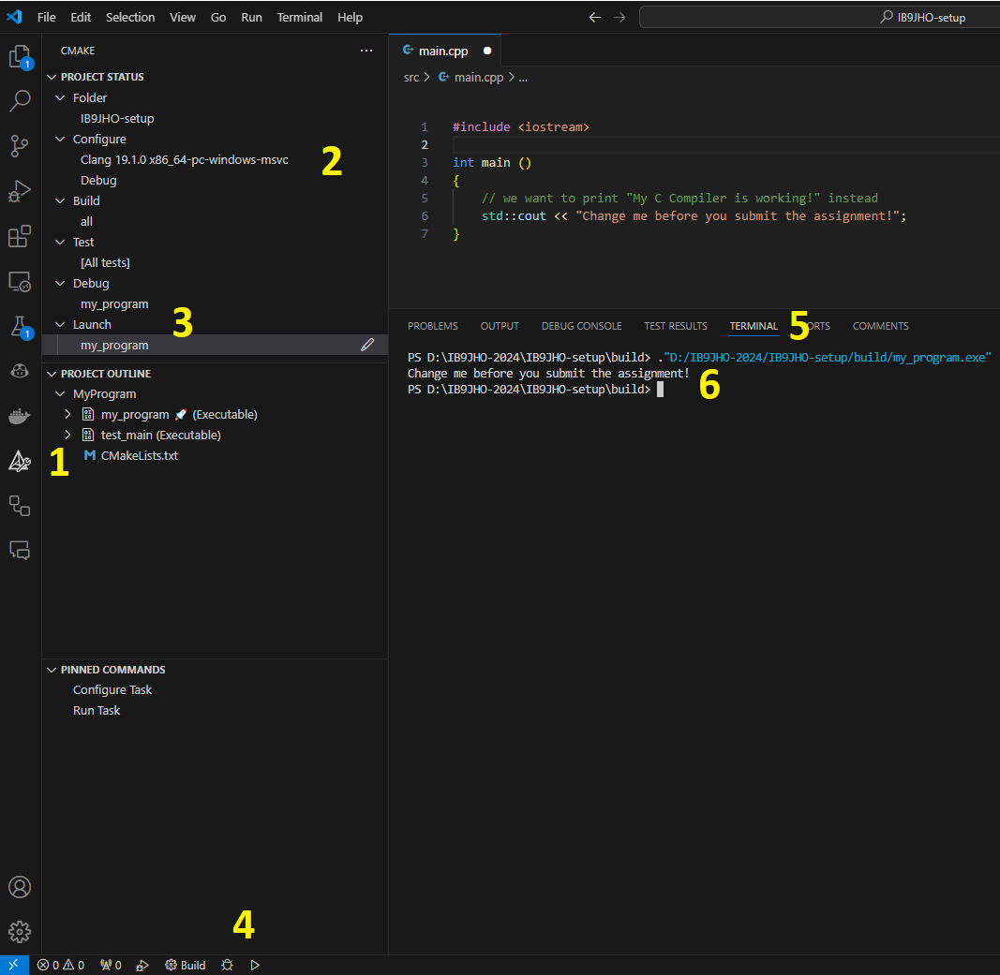
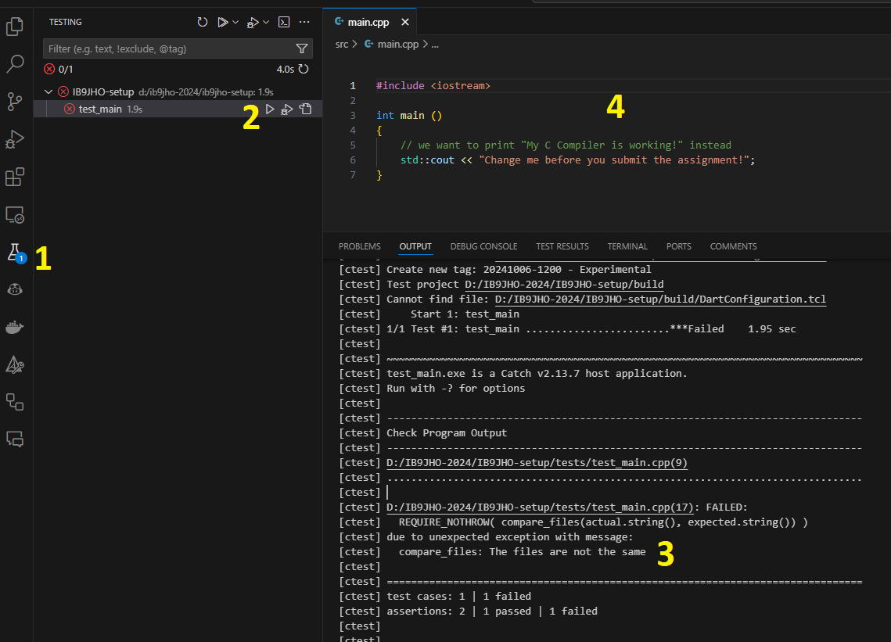
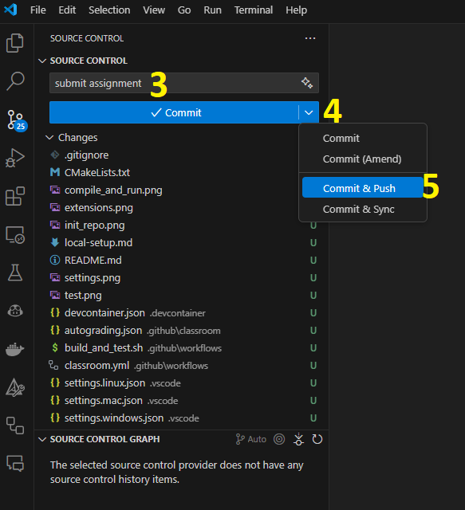
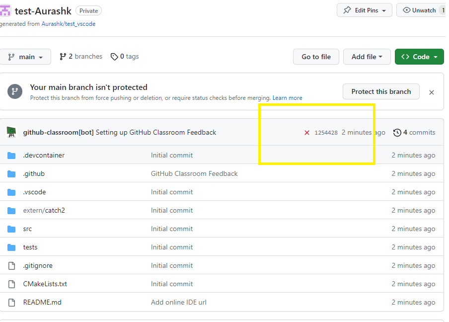

## IB9JHO Environment setup

Follow these instructions to set up your programming environment for IB9JHO and check it works correctly.

- Set up a local environment on your own device (recommended) - see [local environment setup](local-setup.md)
- Open a codespace in the cloud - see [cloud back up environment](cloud-backup.md)

You are recommended to use your own device for programming because it is much faster, not limited on computing resources, and available offline. You should only use a codespace as a backup/temporary option. Furthermore you should always select the **clang compiler** when prompted while you are working on IB9JHO. This ensures we are all using the same/similar build tools for C++.

# Check your environment works

Test that your environment is working by compiling and running the C++ code in this repository found in src/main.cpp.
If you are not working in a codespace you should first download the repository from github by entering the following command in the terminal on your device.

\* Note that you can copy the correct link from the github page by clicking the green code button, selecting clone, and coping the https link.

```
git clone *https://github.com/repo-owner/repo-name folder\to\clone\to
```

You can also download the repository in a zip archive, but you should generally use git clone when you are working with repositories.

Open the folder with Visual Studio Code and follow the instructions below.

1. **Open the cmake tab** This will show you the various executable programs you can build from the source files in your project.
2. **Check that the clang kit is selected** We will all use the same build tools in the course to avoid any confusion/compatibility issues.
3. **Check that my_program is selected** as the launch target.
4. **Click the play button** to compile and run the launch target you selected (my_program).
5. **Click the terminal tab** This is where standard output will be displayed.
6. **Check the output** You should see the text match the text in src/main.cpp.

<br><br>

# Testing

Assignments are marked automatically using tests which check the output of your code. The tests for this repository are initially failing because the output of our program is not what is expected. The correct output can be found in tests/IO/correct_output.txt.

1. **Open the test tab** This will show you all the tests available for the project.
2. **Click the play button** to run a test
3. **Check the output** The output of the test will be displayed in the output tab. Notice that it says the two files (tests/IO/correct_output.txt and tests/IO/expected_output.txt) are not the same.
4. **Correct the code** Correct the code and rerun the test to see that it passes.

<br><br>

# Pushing your changes to github

You should push (update) your repository on GitHub regularly with your local to make sure you don't lose any work. Especially if you are programming in a codespace. Take care to review the changes before you push, as it is not easy to reverse your changes once you have pushed them. The module tutor will have access to all the repositories on GitHub so you can reference it directly if you need feedback on something specific.

The first time you use git on your device you will need to set up your name and email in order to make commits to a repository. You only need to do this once. Type these commands in a shell/PowerShell/terminal window.

```
git config --global user.name "PUT YOUR NAME HERE"
git config --global user.email "PUT YOUR EMAIL HERE"
```

1. **Open the source control tab** This will show you all the changes you have made to the repository.
2. **Initialise the repository** To start tracking changes in the repository.
3. **Add a commit message** Write a summary of the changes you made.
4. **Open the commit tab**
5. **Commit and push**
6. **Check github** You should see the changes you made in the repository.

<br><br>
<br><br>

# Submitting Assignments

Once you have pushed to your repository for your final submission with all the tests passing you should notice the red cross will change to a green tick in
github. Then you can be confident your assignment is complete and your answers were correct.

**Tests are *not* passing yet**
<br><br>

**Tests are passing**
<br><br>
